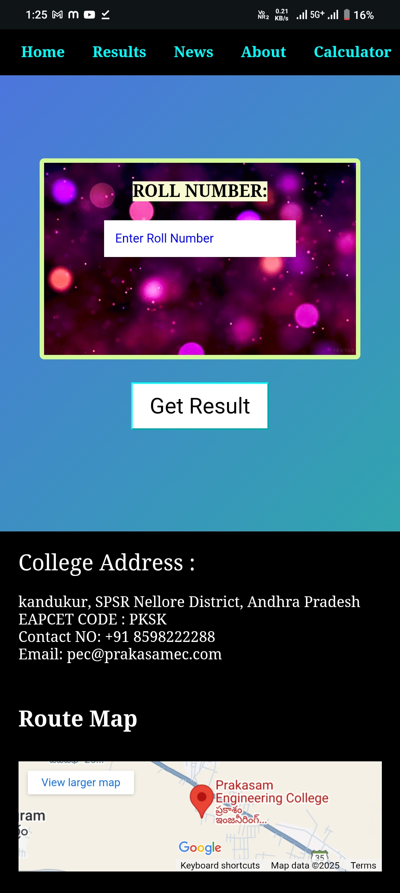

Prakasam Engineering College Results Portal – Documentation

1. Project Overview

Project Name: Prakasam Engineering College Results Portal
Live Link: https://saisadam.github.io/result/
Purpose: A fast and simple website to check 2025 exam results by roll number.

2. Features

User-friendly design

Roll number-wise result search

Mobile-friendly UI

Lightweight and fast loading

Hosted on GitHub Pages

SEO optimized (verified on Google Search Console)

3. Supported Roll Numbers

The portal currently supports roll numbers from:
23F91A05F1 → 23F91A05J8 (Started with less number of students)

4. Tech Stack

Frontend: HTML, CSS, JavaScript

Hosting: GitHub Pages

SEO Tools: Meta description, Sitemap.xml

5. Project Structure

result/
│── index.html       # Main website
│── style.css        # CSS file
│── script.js        # JavaScript file (if added)
│── sitemap.xml      # Sitemap for search engines
│── verify.html      # Google Search Console verification
│── README.md        # Documentation

6.
  

Roll Number Search Result:

7. SEO & Indexing

Verified on Google Search Console

Sitemap submitted for faster indexing

Optimized meta description for better search ranking

8. Contributing

1. Fork the repository

2. Make changes

3. Submit a pull request

9. Contact

Author: Sai Sadam

GitHub: https://github.com/saisadam

Live Project: https://saisadam.github.io/result/

Do Follow For More
Thanks for Reading

